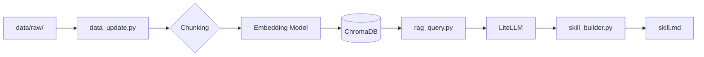

[](https://classroom.github.com/a/mhxNhwtV)
# Build Your Personal RAG: AI Agent Systems

---

## 1. 專案簡介 | Project Overview

本專案的知識主題為 **AI Agent Systems**，涵蓋 Agent Execution Loop、Planning、Memory、Tool Use、Multi-Agent Systems 與 Agent Frameworks（LangGraph / CrewAI / AutoGen）。

選擇此主題原因：
1. Agent 系統具備明確流程與結構
2. 同時包含框架、方法論與實作
3. 可生成具價值的 Skill 文件供 Agent 使用

資料來源：
- Markdown / TXT 文件
- 約 20 份
- 涵蓋 agent frameworks、execution、multi-agent 等

技術架構：
- Embedding：sentence-transformers
- Vector DB：ChromaDB
- LLM：LiteLLM（Gemini）
- Pipeline：data_update → rag_query → skill_builder

---

## 2. 系統架構



---

## 3. 設計決策

### Chunking
- 500 長度 + 100 overlap
- 保持語意連續

### Embedding
- paraphrase-multilingual-MiniLM-L12-v2
- 支援中英、本地執行

### Vector DB
- ChromaDB（無需 server）

### Retrieval
- top-k = 5

### Prompt
- 限制只能使用 context
- 必須附來源

### Idempotency
- 使用 --rebuild 重建

### skill_builder
- 使用 global questions 萃取知識

---

## 4. 環境設定

### Python
```bash
python3 --version
```

### 虛擬環境
```bash
python3 -m venv .venv
source .venv/bin/activate
```

Windows:
```powershell
.venv\Scripts\activate
```

### 安裝
```bash
pip install -r requirements.txt
```

### 設定 .env
```bash
cp .env.example .env
```

填入：
- LITELLM_API_KEY
- LITELLM_BASE_URL

### 建立索引
```bash
python data_update.py --rebuild
```

### 測試
```bash
python rag_query.py --query "what is this system?"
```

### 生成 skill
```bash
python skill_builder.py --output skill.md --model gemini-2.5-flash --skill-name "AI agent"
```

---

## 5. 資料來源

| 類型 | 說明 |
|------|------|
| Markdown | Agent frameworks |
| TXT | execution / planning |
| 教學用途 | 合規 |

---

## 6. 限制與未來改進

限制：
- 無 rerank
- 無 semantic chunking

未來：
- 加入 rerank
- 支援 PDF
