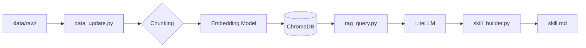

# AI Agent RAG System

這個專案實作了一套基於 Retrieval-Augmented Generation（RAG）的文件檢索與知識整理系統。
主要目的是將多份非結構化文件轉換為可搜尋的知識庫，並透過語意檢索與大型語言模型（LLM）產生整理後的內容。

---

## 系統功能

* 將原始文件進行清理與切分（chunking）
* 使用 sentence-transformers 進行語意向量化（embedding）
* 透過 ChromaDB 建立向量資料庫
* 支援語意搜尋與問答（rag_query.py）
* 回答結果包含來源資訊（source reference）
* 使用 skill_builder 自動整理知識，產生 skill.md

---

## 系統流程



---

## 專案結構

```
data/               原始與處理後文件
src/                核心模組（chunker、embedder、retriever 等）
data_update.py      建立 / 更新向量資料庫
rag_query.py        問答系統（CLI）
skill_builder.py    產生整理後的知識文件
skill.md            系統輸出的知識摘要
```

---

## 使用方式

### 1. 安裝環境

```
pip install -r requirements.txt
```

### 2. 建立向量資料庫

```
python data_update.py --rebuild
```

### 3. 查詢

```
python rag_query.py --query "your question"
```

或進入互動模式：

```
python rag_query.py
```

### 4. 生成知識整理文件

```
python skill_builder.py
```

---

## 使用技術

* Python
* sentence-transformers
* ChromaDB
* LiteLLM / Gemini
* RAG（Retrieval-Augmented Generation）

---

## 說明

本專案重點在於實作完整的 RAG 流程，包含資料處理、語意檢索與內容生成，並嘗試將查詢結果進一步整理成結構化的知識文件。
- 加入 rerank
- 支援 PDF
